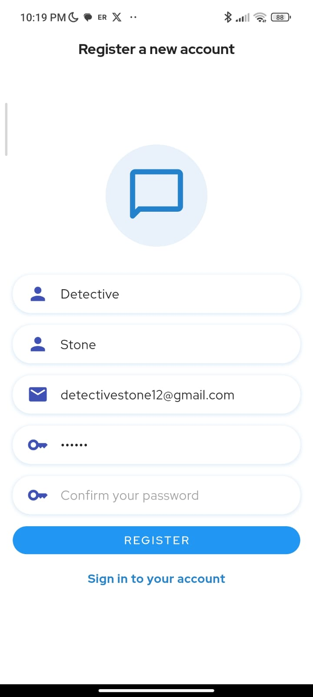
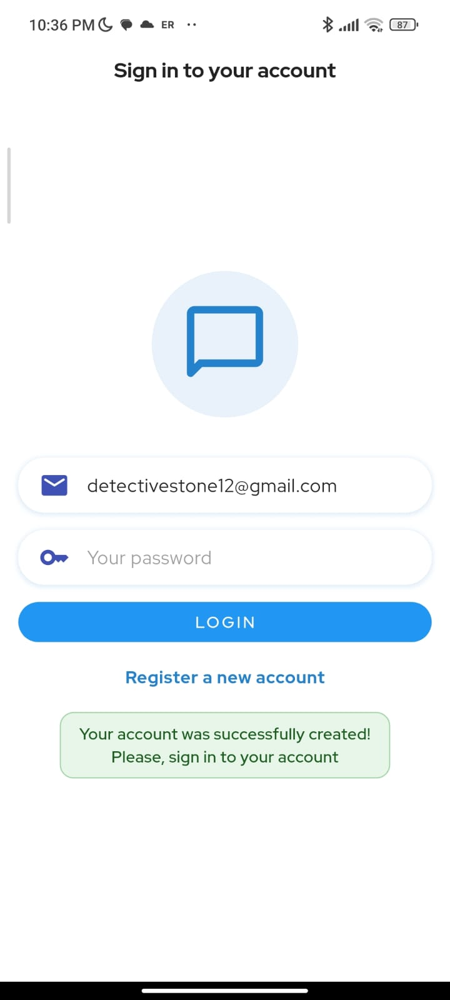
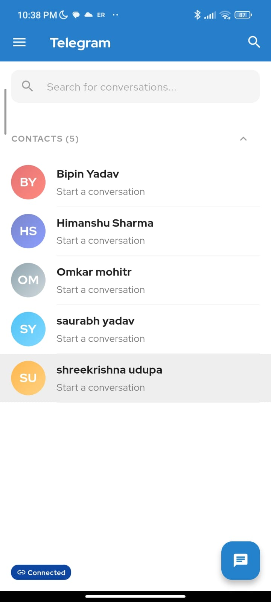
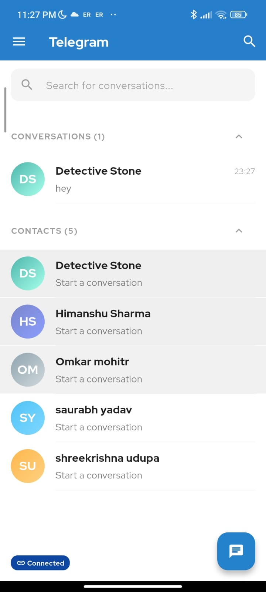
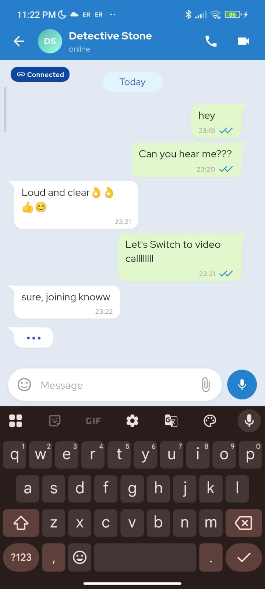
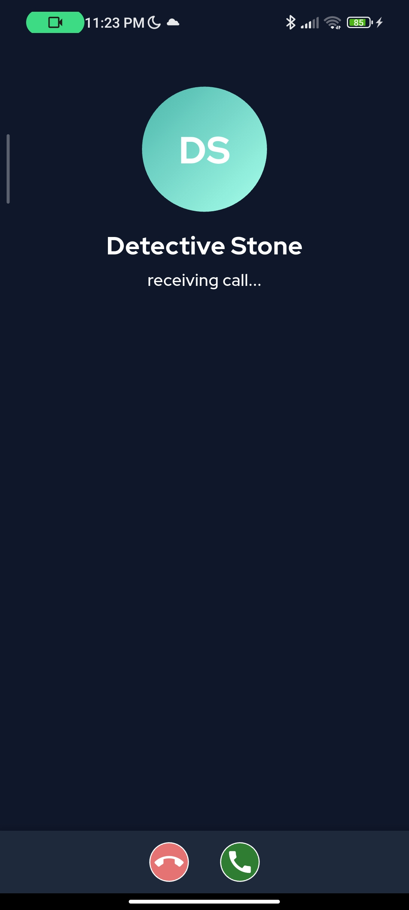
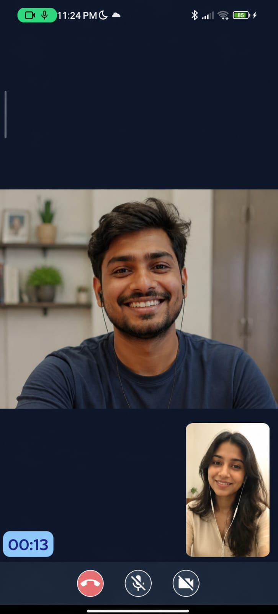

# ⚡ Telegram-Style Realtime Chat App with WebRTC Video & Audio Calling

A premium, production-grade full-stack real-time chat application built with **Flutter (Dart)**, **Node.js (TypeScript)**, **MySQL**, and **WebRTC** for high-quality audio and video calls. The user interface is completely redesigned to match the clean, minimalist aesthetics and snappy feel of **Telegram**.

---

## 📸 App Showcase

Here is a visual walk-through of the application running on a physical Android device:

### 1. Welcome & Authentication
| **Register Account** | **Sign In** |
|:---:|:---:|
|  |  |

### 2. Main Interface & Contacts List
| **Conversations List** | **Active Chats Drawer** |
|:---:|:---:|
|  |  |

### 3. Messaging & Calls
| **Live Chat Room** | **Incoming Call Screen** | **Active Video Call** |
|:---:|:---:|:---:|
|  |  |  |

---

## ✨ Features

* **💬 Telegram UI/UX**: Snappy animations, clean primary Telegram Blue theme (`#2481CC`), thin item dividers, and full-screen calling layouts.
* **⚡ Instant Messaging**: Real-time message delivery and delivery status indicators (sending, sent, read ticks) powered by WebSockets.
* **🎨 Name-Hashed Avatars**: Auto-generated initials avatars inside circular containers with premium gradient backgrounds calculated dynamically using the user's name hash.
* **📞 WebRTC Calls**: Immersive, peer-to-peer audio and video calling with responsive local and remote video overlays.
* **🔍 Search & Filter**: Real-time list filtering for conversations and contacts.
* **🔒 Dynamic IP Auto-Detection**: Dynamically resolves browser hostnames on web builds to prevent manual IP updates when testing on local network browsers.
* **🗄️ Relational Database Persistence**: Real-time synchronization and data persistence using **MySQL** and **TypeORM**.

---

## 🛠️ Tech Stack & Architecture

### Frontend (Flutter Client)
* **Language**: Dart
* **Architecture**: Clean Architecture / Feature-Driven Development
* **Dependency Injection**: `get_it` with `injectable`
* **State & Networking**: `askless` (WebSocket-based client framework)
* **Real-time Call Engine**: `flutter_webrtc`

### Backend (Node.js Server)
* **Language**: TypeScript
* **Server Framework**: `askless` (WebSocket server framework)
* **ORM**: `TypeORM`
* **Database**: MySQL

---

## 📂 Project Structure

```text
├── flutter_app/                # Flutter Client Application
│   ├── lib/
│   │   ├── core/               # Shared widgets (UserAvatar), routes, and theme configurations
│   │   └── features/           # Modular features: call, chat, loading, login_and_registration
│   └── pubspec.yaml
│
└── nodejs_websocket_backend/   # Node.js TypeScript Backend
    ├── src/
    │   ├── entity/             # TypeORM Database Entities (User, Message)
    │   ├── environment/        # Database configurations (db.ts)
    │   └── index.ts            # Entrypoint & Askless server handlers
    └── package.json
```

---

## 🚀 Step-by-Step Setup Guide

### Prerequisites
Before starting, ensure you have the following installed:
* [Flutter SDK](https://docs.flutter.dev/get-started/install) (version 3.22+ recommended)
* [Node.js](https://nodejs.org/en) (v18+)
* [MySQL Server](https://dev.mysql.com/downloads/installer/) (or running via XAMPP/WAMP)

---

### Step 1: Set Up MySQL Database
1. Open your MySQL command-line client or GUI tool (like phpMyAdmin or DBeaver).
2. Create a new database for the application:
   ```sql
   CREATE DATABASE flutter_chat_app_with_nodejs;
   ```
3. Open `nodejs_websocket_backend/src/environment/db.ts` and update your database credentials:
   ```typescript
   export const dbDatasourceOptions: DataSourceOptions = {
       type: "mysql",
       host: "127.0.0.1",
       port: 3306,
       username: "YOUR_MYSQL_USERNAME",  // Default: root
       password: "YOUR_MYSQL_PASSWORD",  // Default: root
       database: "flutter_chat_app_with_nodejs",
       synchronize: true, // Auto-creates database tables
       entities: [TextMessageEntity, UserEntity],
   }
   ```

---

### Step 2: Configure and Start the Node.js Server
1. Navigate into the backend directory:
   ```bash
   cd nodejs_websocket_backend
   ```
2. Install npm dependencies:
   ```bash
   npm install
   ```
3. Start the server in development mode:
   ```bash
   npm run dev
   ```
   *Your server will start and bind to `ws://0.0.0.0:3000` (listening on all local interfaces).*

---

### Step 3: Configure client WebSocket URLs
The Flutter app needs to connect to the backend server. 

1. Find your computer's local Wi-Fi IPv4 address:
   * **Windows (Command Prompt)**: Run `ipconfig` (Look for the `IPv4 Address` under your active Wi-Fi connection, e.g., `192.168.0.103`).
2. Open `flutter_app/lib/core/data/data_sources/connection_remote_ds.dart`.
3. Update the fallback IP address on line 14 with your laptop's local IP address:
   ```dart
   class ConnectionRemoteDS {
     String get serverUrl {
       if (kIsWeb) {
         // Auto-detects the server URL if running in the browser
         final host = Uri.base.host.isNotEmpty ? Uri.base.host : 'localhost';
         return "ws://$host:3000";
       }
       // Fallback for native devices/physical phones
       return "ws://192.168.0.103:3000"; // Replace with your local IP
     }
   }
   ```

---

### Step 4: Run the Flutter Client

#### Run on Web (Browser):
Ensure you are in the `flutter_app` folder, then run:
```bash
flutter run -d chrome
```

#### Run on a Physical Phone or Emulator:
1. Connect your phone via USB or start your emulator.
2. Ensure your phone is connected to the **same Wi-Fi network** as your laptop.
3. Build and launch the app:
   ```bash
   flutter clean
   flutter run
   ```

---

## 🛠️ Troubleshooting & Networking Barriers

If you get the error **"An error occurred, please try again later"** during registration or login on your physical phone, the phone's request is not reaching your laptop's backend. Check the following:

### 1. Allow Port 3000 in Windows Defender Firewall
Windows Firewall blocks incoming traffic from external network devices to port `3000`. You must create an inbound rule:
1. Open the Start menu, search for **"Windows Defender Firewall with Advanced Security"** and open it.
2. Click **Inbound Rules** on the left menu.
3. Click **New Rule...** on the right menu.
4. Select **Port** -> Click **Next**.
5. Select **TCP** -> In **Specific local ports**, enter `3000` -> Click **Next**.
6. Select **Allow the connection** -> Click **Next**.
7. Keep all profiles checked (Domain, Private, Public) -> Click **Next**.
8. Name it **"Flutter Chat Backend (3000)"** and click **Finish**.
9. Restart your Node.js backend.

### 2. Bypass Router "AP Isolation"
Some routers block connected Wi-Fi devices from communicating with each other. 
To bypass this:
1. Turn on **Mobile Hotspot** on your phone.
2. Connect your laptop to your phone's Wi-Fi hotspot.
3. Find your laptop's new IP address using `ipconfig` and update `connection_remote_ds.dart`.
4. Run the app.

### 3. Gradle File Locking Issues
If the build fails with `Cannot lock execution history cache as it has already been locked by this process`, kill any dangling Java processes holding the lock.
Run in PowerShell:
```powershell
Stop-Process -Name "java" -Force -ErrorAction SilentlyContinue
Stop-Process -Name "adb" -Force -ErrorAction SilentlyContinue
flutter clean
flutter run
```
